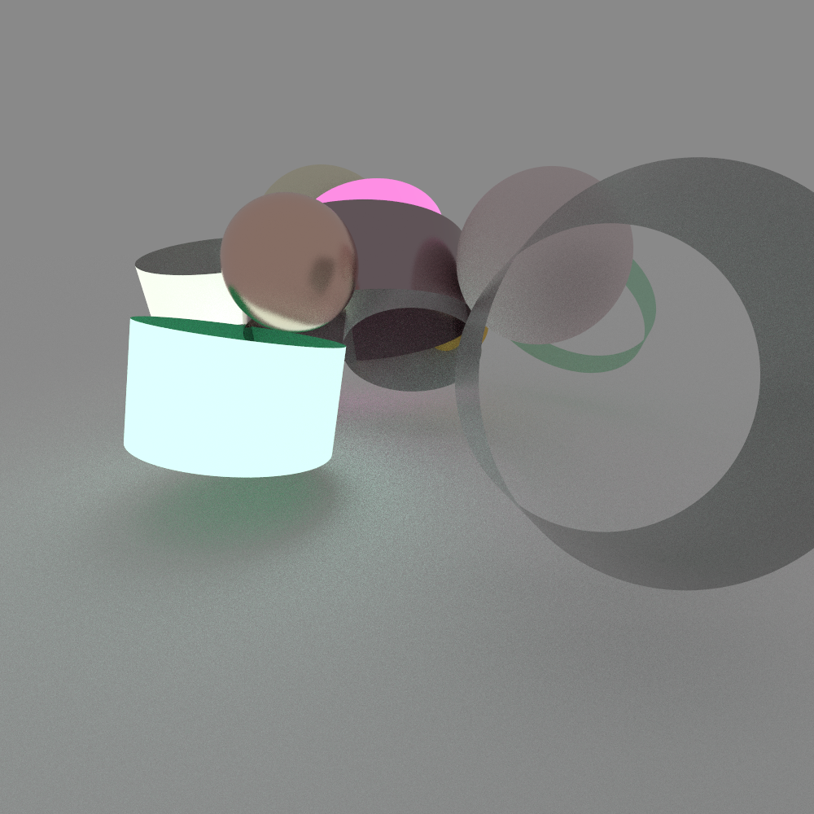

# scene-gen

---

Linux only, dependencies: OpenImageIO, TinyXML2, Eigen3

Code for environment emitters, bsdf bump maps, and .obj/.ply shapes is commented out as these are not part of the repository due to licensing.

```
mkdir build
cmake ..
make

./SceneGen > scene.xml
mitsuba scene.xml
```


